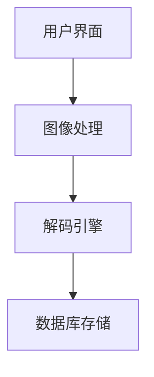

# 二维码/条形码解码工具 - 全方位使用说明书

## 📜 版权声明
**© 2025 杜玛 永久所有**  
未经书面许可，不得转载或用于商业用途  
项目地址：https://github.com/duma520  
问题报告：通过GitHub Issues提交  
注意：我们不提供私人邮箱支持，所有技术支持都通过公开渠道进行

---

## 📌 目录
1. [基础介绍](#-基础介绍)
2. [快速入门](#🚀-快速入门)
3. [功能详解](#🔍-功能详解)
4. [专业应用](#⚙️-专业应用)
5. [常见问题](#❓-常见问题)
6. [版本历史](#🔄-版本历史)
7. [技术细节](#🔧-技术细节)

---

## 🌟 基础介绍

### 这是什么？
这是一款功能强大的二维码/条形码解码工具，支持多种格式的识别和解码，具有直观的用户界面和丰富的历史记录功能。

### 适用人群
- **普通用户**：快速识别商品条形码、微信二维码等
- **办公人员**：批量处理文档中的二维码信息
- **开发人员**：调试二维码生成效果
- **仓储物流**：识别货物条形码
- **教育工作者**：制作教学素材
- **市场营销**：分析竞争对手的营销二维码

### 支持的类型
| 类型 | 示例用途 |
|------|----------|
| QR码 | 微信支付、网页链接 |
| EAN-13 | 商品条形码 |
| Code 128 | 物流包裹 |
| Data Matrix | 工业零件标识 |
| PDF417 | 机票、证件 |

---

## 🚀 快速入门

### 第一步：安装
1. 确保已安装Python 3.7+
2. 下载程序文件
3. 安装依赖：`pip install -r requirements.txt`

### 第二步：基本使用
1. **加载图片**：点击"加载图片"按钮或直接拖放图片到窗口
2. **解码**：点击"解码"按钮
3. **查看结果**：右侧显示解码内容

### 生活场景示例
- **超市购物**：扫描商品条形码查看生产信息
- **餐厅点餐**：识别菜单上的二维码获取电子菜单
- **活动签到**：扫描入场二维码快速登记

---

## 🔍 功能详解

### 1. 图片加载
- **从文件加载**：支持PNG/JPG/JPEG/BMP格式
- **从剪贴板粘贴**：Ctrl+V快速粘贴截图
- **拖放操作**：直接拖拽图片到窗口

### 2. 解码功能
- 自动识别多种二维码和条形码
- 显示识别区域标记
- 多码同时识别（如一张图片中有多个二维码）

### 3. 历史记录
- 自动保存每次扫描记录
- 按时间倒序排列
- 收藏重要记录（点击"收藏"按钮）

### 4. 数据管理
- **导出数据**：CSV/JSON格式
- **备份恢复**：完整数据库备份
- **批量删除**：多选后批量操作

---

## ⚙️ 专业应用

### 商业分析
- 批量扫描竞品包装上的二维码，分析营销策略
- 导出CSV进行数据统计

### 开发调试
- 验证生成的二维码是否正确
- 测试不同尺寸的识别率

### 仓储管理
- 批量扫描货品条形码
- 导出JSON与库存系统对接

### 高级技巧
```python
# 通过命令行批量处理
python QRCodeDecoder.py --batch /path/to/images
```

---

## ❓ 常见问题

### Q1: 扫描不成功怎么办？
- 确保图片清晰
- 调整角度避免反光
- 尝试提高图片对比度

### Q2: 如何批量处理？
1. 将所有图片放入一个文件夹
2. 使用导出功能合并结果

### Q3: 支持哪些编码格式？
- UTF-8
- ASCII
- 二进制数据

---

## 🔄 版本历史

### v1.11.0 (2025-05-20)
- 新增多选操作功能
- 优化数据库结构
- 增强剪贴板图片处理

### v1.10.0
- 增加马卡龙配色方案
- 添加收藏功能
- 修复内存泄漏问题

### v1.0.0
- 初始发布版本
- 基本解码功能
- 历史记录管理

---

## 🔧 技术细节

### 系统架构


### 性能指标
- 平均解码时间：<500ms
- 最大支持分辨率：4096x4096
- 内存占用：<50MB

### 开发者文档
```python
# 扩展自定义解码器
class CustomDecoder:
    def decode(self, image):
        # 实现自定义逻辑
        return results
```

---

## 📝 最后说明
本工具完全免费开源，欢迎贡献代码或提出建议。更多技术细节请查阅项目Wiki页面。

**记住**：使用他人二维码请遵守相关法律法规，尊重隐私和版权。
